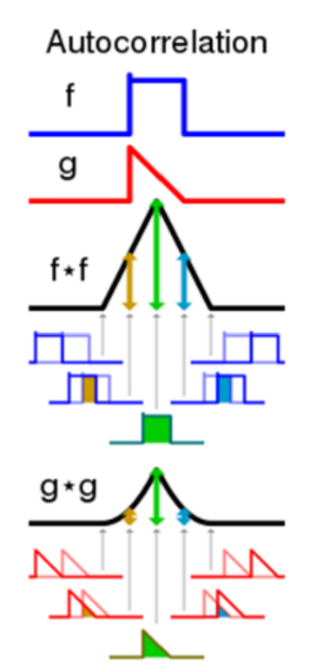
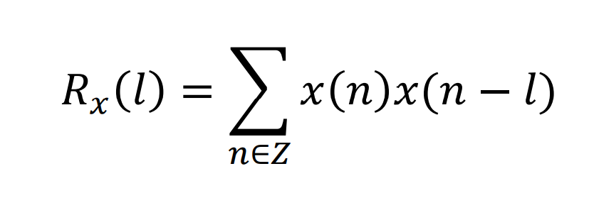

# PDA-Micro
Implementation of a digital signal processing system

The purpose of this project is to develop an autocorrelation-based human pitch detecting system.
An approximate measurement of the fundamental frequency or pitch of a quasi-periodic signal, such as human vocalizations, is provided by a pitch detection algorithm. Voiced noises are those made by humans that cause the larynx's vocal cords to vibrate while producing sound. The fundamental frequency range of the human voice is wide, however it often falls between 85 and 350 Hz. whichever sound
Conversely, if the speaker has a lower voice (such as males), the base frequency value will be higher; if the speaker has a lower voice (such as women), the base frequency value will be lower.

  

The topic of time and frequency has seen the introduction of numerous PDA algorithms. The suggested algorithm in this project is based on computing the input audio signal's time-domain autocorrelation.
The correlation value (inner product or points) between the signal and its own delay is the autocorrelation function of a discrete signal, such as a sampled audio signal, in terms of a delay. To put it another way, the autocorrelation function in terms of lag l for a discrete signal n(x) with finite energy is as follows:

In this project, it is assumed that the final system will be implemented using an Arduino UNO board, so the microcontroller used will be the ATmega328P, which is set up with a frequency of 16 MHz.
The input audio signal is sampled at a specific rate and stored in an internal buffer in the final implementation. The autocorrelation function of the input audio signal is then computed, and the first non-zero peak whose magnitude is greater than a threshold is looked for. Design factors include sampling rate, precision (number of bits) selected from the output of the analog to digital converter, internal buffer size, and pitch detection threshold.
